# Visualisasi Diagram Sistem — SoundWave

Dokumen ini berisi seluruh diagram perancangan sistem aplikasi **SoundWave** (music streaming platform).
Seluruh diagram ditulis menggunakan sintaks **Mermaid** sehingga dapat dirender langsung di GitHub, VS Code (ekstensi Markdown Preview Mermaid), maupun editor Markdown lain yang mendukung Mermaid.

**Tech Stack:** Next.js 16 / React 19 (Frontend) · Express.js · TypeScript · Prisma ORM · PostgreSQL · JWT · Google OAuth · Deezer/YouTube API · Vercel

---

## Daftar Isi
1. [Use Case Diagram](#1-use-case-diagram)
2. [Entity Relationship Diagram (ERD)](#2-entity-relationship-diagram-erd)
3. [Logical Record Structure (LRS)](#3-logical-record-structure-lrs)
4. [Class Diagram](#4-class-diagram)
5. [Arsitektur Sistem (System Architecture)](#5-arsitektur-sistem-system-architecture)
6. [Component Diagram](#6-component-diagram)
7. [Deployment Diagram](#7-deployment-diagram)
8. [Sequence Diagram](#8-sequence-diagram)
9. [Activity Diagram](#9-activity-diagram)
10. [Data Flow Diagram (DFD)](#10-data-flow-diagram-dfd)
11. [Arsitektur Full-Stack (FE · BE · API · DB)](#11-arsitektur-full-stack-fe--be--api--db)
12. [Sequence Diagram End-to-End (Alur Pemakaian Web Lengkap)](#12-sequence-diagram-end-to-end-alur-pemakaian-web-lengkap)

---

## 1. Use Case Diagram

Aktor: **Guest** (tanpa login), **User**, **Admin**, **Super Admin**. Relasi pewarisan menunjukkan setiap aktor di atasnya mewarisi kemampuan aktor di bawahnya.

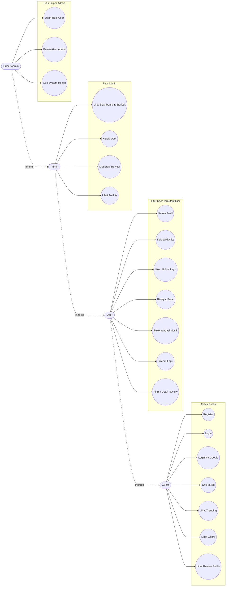

**Catatan relasi `<<include>>`:**
- `Kelola Playlist` meng-*include* `Tambah Lagu ke Playlist` dan `Hapus Lagu dari Playlist`.
- `Stream Lagu` meng-*include* `Riwayat Putar` (setiap pemutaran dicatat).
- `Moderasi Review` meng-*include* `Balas Review` dan `Hapus Review`.

---

## 2. Entity Relationship Diagram (ERD)

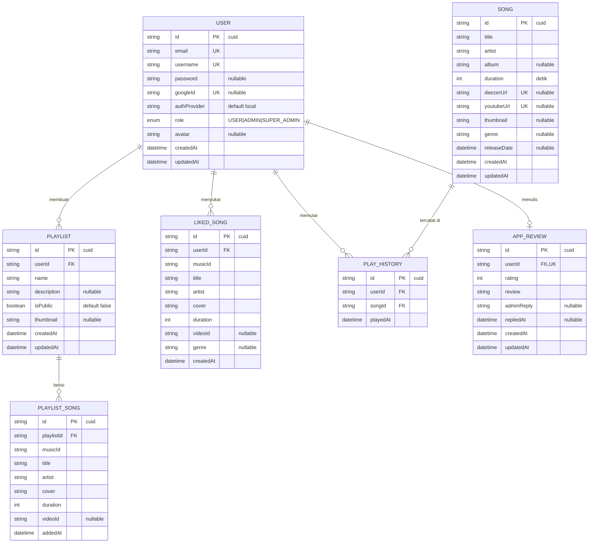

**Kardinalitas:**
| Relasi | Tipe | Keterangan |
|--------|------|------------|
| User – Playlist | 1 : N | Satu user punya banyak playlist |
| User – LikedSong | 1 : N | Satu user menyukai banyak lagu |
| User – PlayHistory | 1 : N | Satu user punya banyak riwayat |
| User – AppReview | 1 : 1 | Satu user satu review (userId unik) |
| Playlist – PlaylistSong | 1 : N | Satu playlist berisi banyak lagu |
| Song – PlayHistory | 1 : N | Satu lagu tercatat di banyak riwayat |

*Constraint unik gabungan:* `PlaylistSong(playlistId, musicId)` dan `LikedSong(userId, musicId)`.

---

## 3. Logical Record Structure (LRS)

LRS menggambarkan struktur record logis hasil transformasi ERD ke tabel relasional, lengkap dengan Primary Key (PK) dan Foreign Key (FK). Tanda panah menunjukkan arah referensi FK.

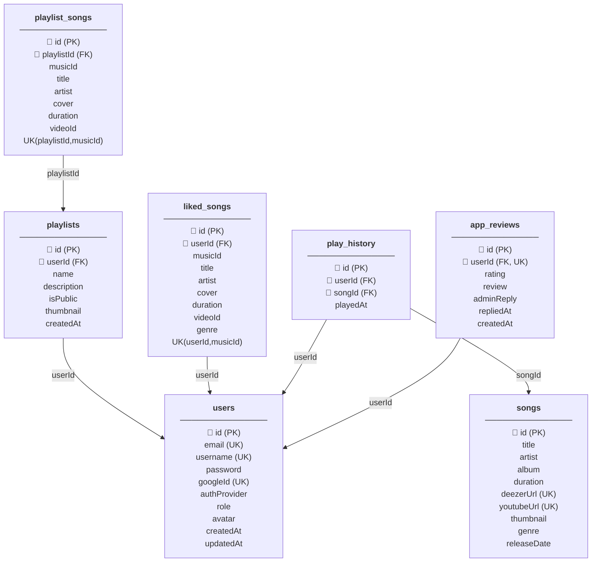

---

## 4. Class Diagram

Struktur kelas mengikuti pola arsitektur MVC (Routes → Controller → Service → Prisma Model).

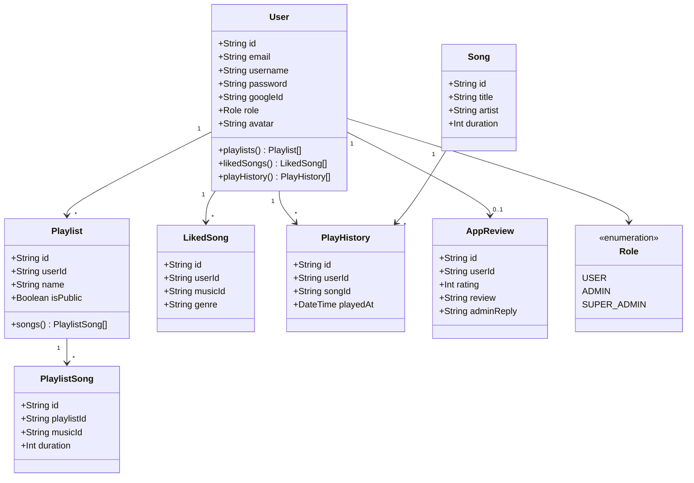

---

## 5. Arsitektur Sistem (System Architecture)

Arsitektur 3-tier dengan integrasi layanan musik eksternal.

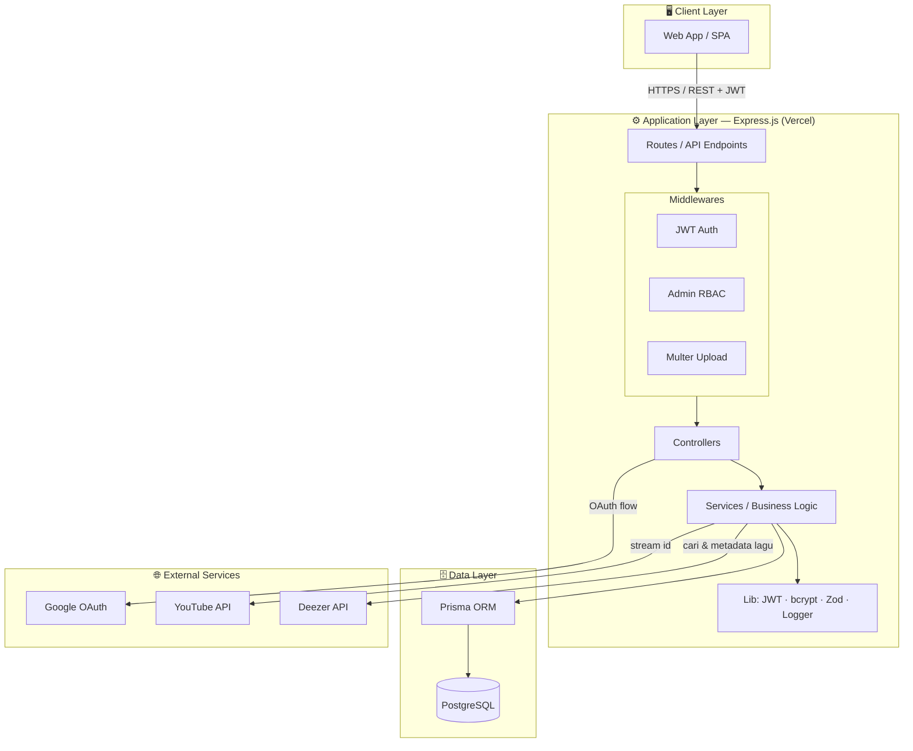

---

## 6. Component Diagram

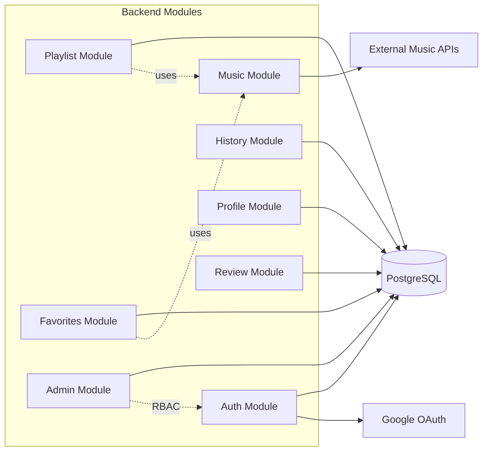

---

## 7. Deployment Diagram

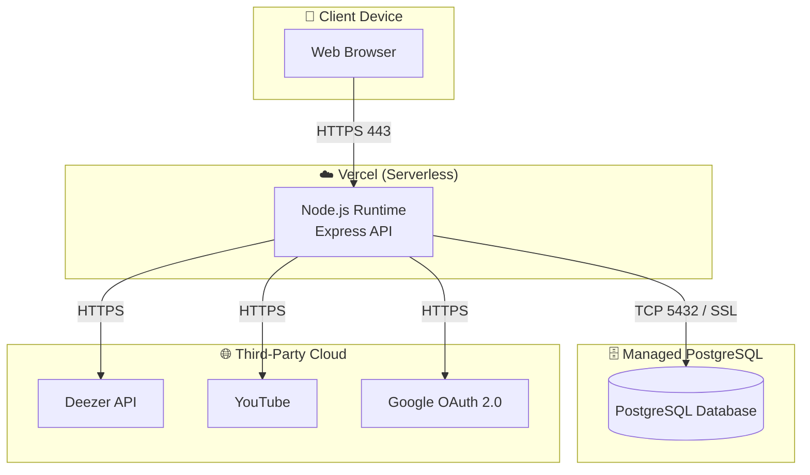

---

## 8. Sequence Diagram

### 8.1 Login (Local Authentication)

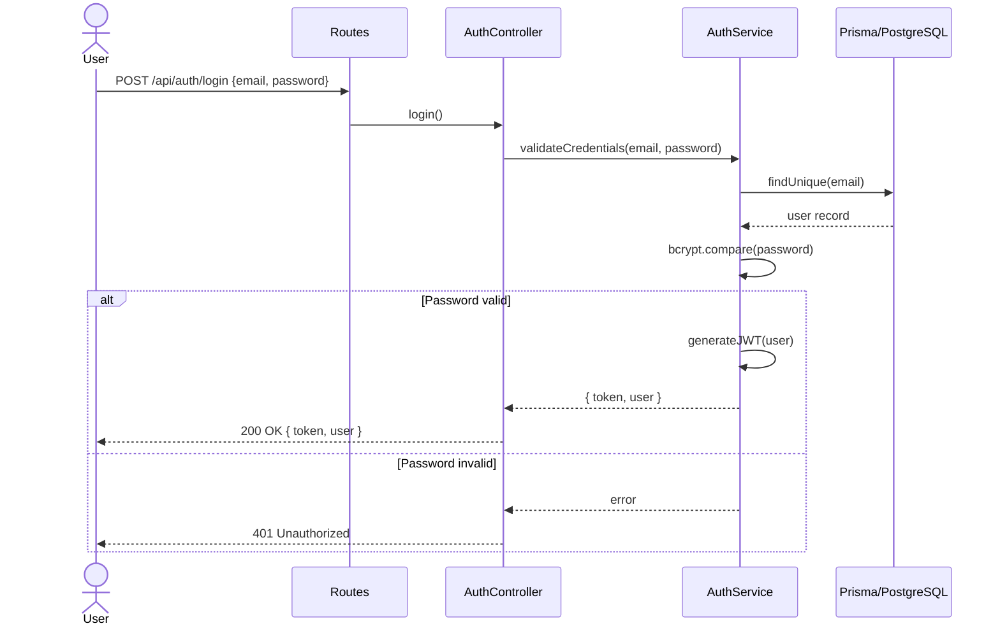

### 8.2 Tambah Lagu ke Playlist

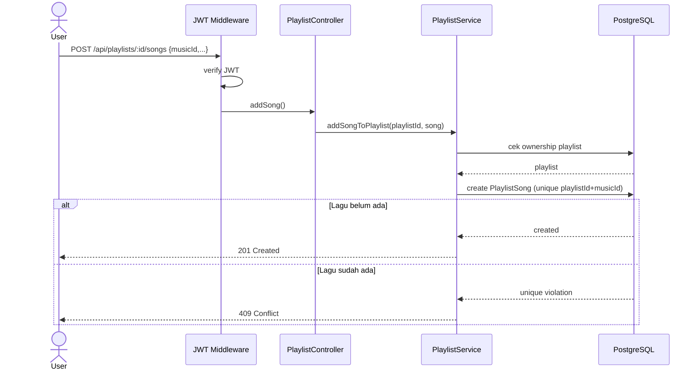

### 8.3 Stream Lagu + Pencatatan Riwayat

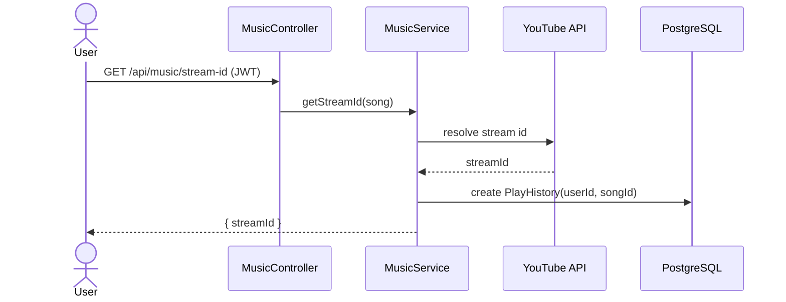

---

## 9. Activity Diagram

### 9.1 Registrasi & Autentikasi

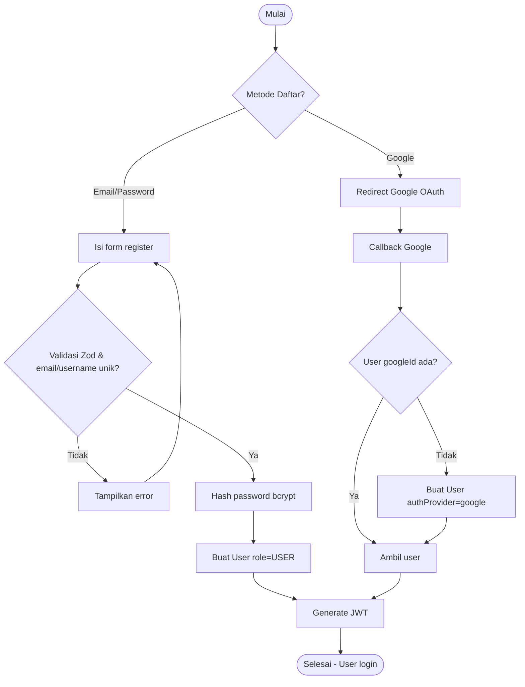

### 9.2 Moderasi Review oleh Admin

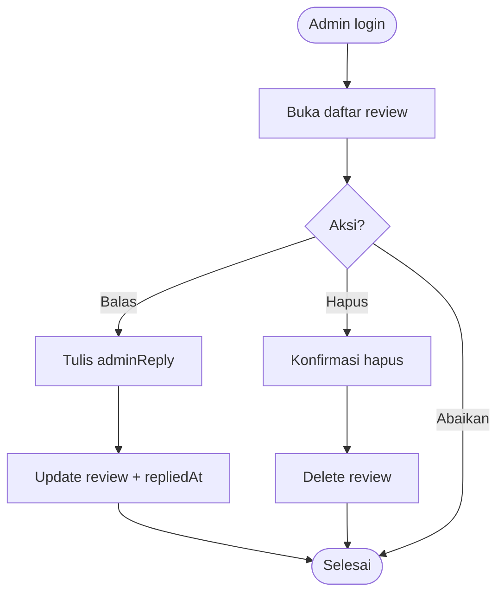

---

## 10. Data Flow Diagram (DFD)

### Context Diagram (Level 0)

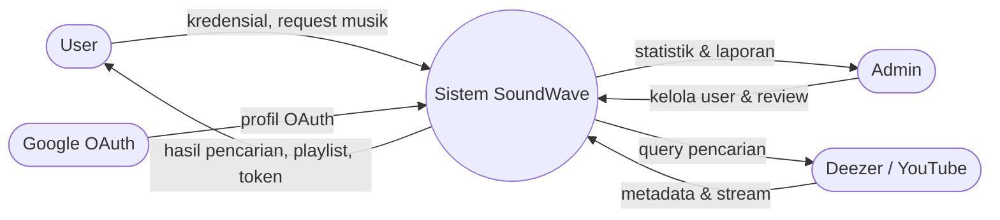

### DFD Level 1

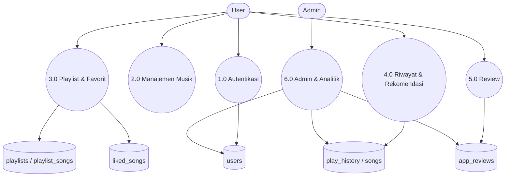

---

## 11. Arsitektur Full-Stack (FE · BE · API · DB)

Diagram arsitektur teknologi nyata yang digunakan: **Frontend** (Next.js/React), **Backend** (Express REST API), **Database** (PostgreSQL via Prisma), serta **layanan eksternal** (Deezer, YouTube, Google OAuth). Warna menandai tiap layer.

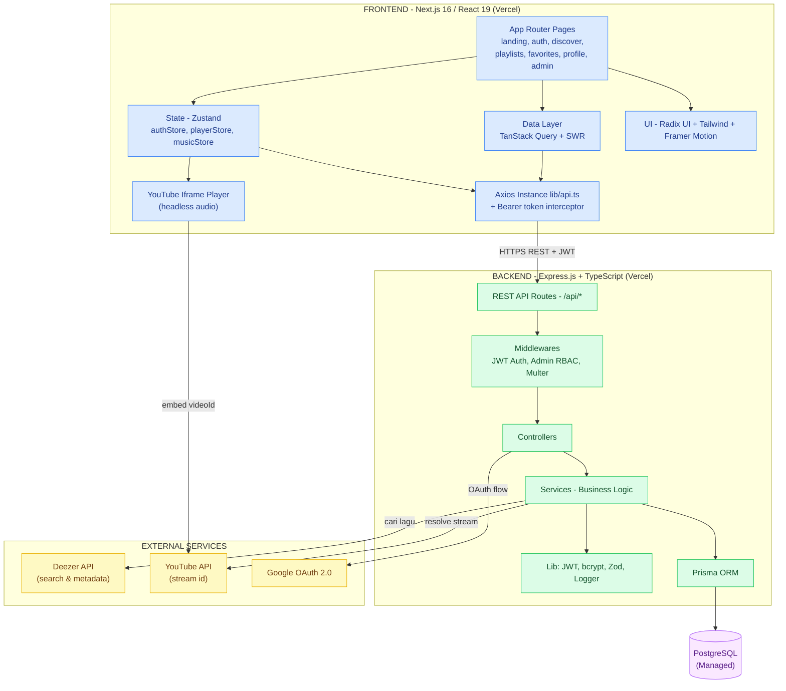

| Layer | Teknologi | Tanggung Jawab |
|-------|-----------|----------------|
| **Frontend (FE)** | Next.js 16, React 19, Zustand, TanStack Query, Radix UI, Tailwind | UI, state management, pemutar audio (YouTube iframe), pemanggilan API |
| **API / Backend (BE)** | Express.js, TypeScript, JWT, Zod | REST endpoint, autentikasi, RBAC, validasi, business logic |
| **Data** | Prisma ORM + PostgreSQL | Persistensi user, playlist, favorit, riwayat, review |
| **External** | Deezer, YouTube, Google OAuth | Metadata lagu, streaming audio, login pihak ketiga |

---

## 12. Sequence Diagram End-to-End (Alur Pemakaian Web Lengkap)

Alur lengkap seorang **User** menggunakan web dari awal (buka situs) hingga akhir (logout): autentikasi → cari musik → putar lagu → like & playlist → rekomendasi → review → logout.

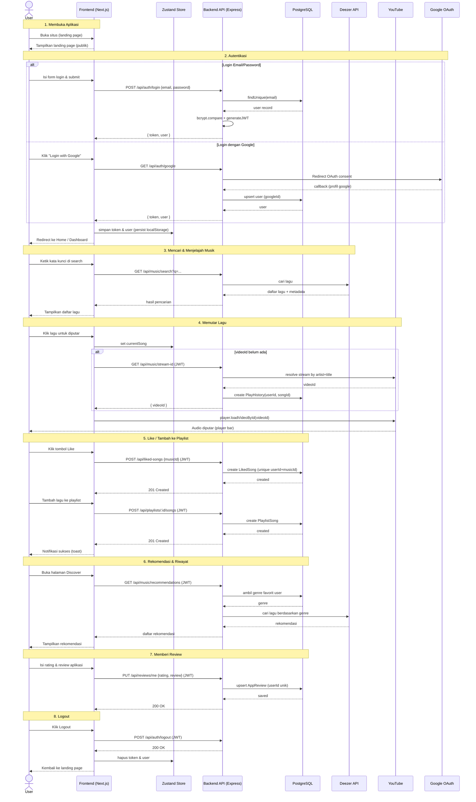

---

> **Cara render:** buka file ini di VS Code dengan ekstensi *Markdown Preview Mermaid Support*, atau langsung di GitHub. Untuk mengekspor ke gambar, gunakan [Mermaid Live Editor](https://mermaid.live) dengan menyalin tiap blok ```mermaid```. Versi gambar PNG siap-pakai tersedia di folder [diagrams/png/](diagrams/png/).
